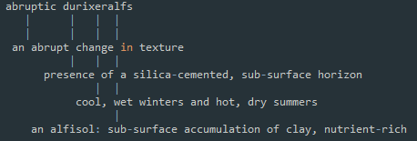
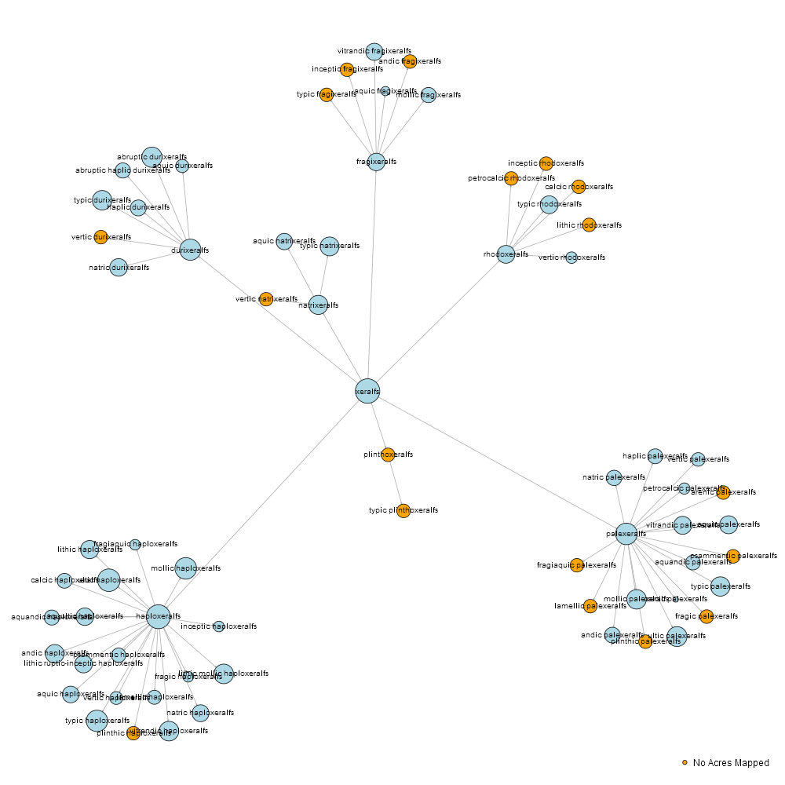

## Code related to Soil Taxonomy Task Force

## Promoting Understanding

## Visualization

## Examples for storing a digital version of the keys

### `data.tree`
<pre>
1  ST                                                                                                    
2   °--alfisols                                                                                          
3       ¦--aqualfs                                                                                       
4       ¦   ¦--albaqualfs                                                                                
5       ¦   ¦   ¦--typic albaqualfs                                                                      
6       ¦   ¦   ¦   ¦--FINE, SMECTITIC, MESIC TYPIC ALBAQUALFS                                           
7       ¦   ¦   ¦   ¦   ¦--AMES                                                                          
8       ¦   ¦   ¦   ¦   ¦--LEAKSVILLE                                                                    
9       ¦   ¦   ¦   ¦   ¦--PIERRON                                                                       
10      ¦   ¦   ¦   ¦   ¦--RUSHVILLE                                                                     
11      ¦   ¦   ¦   ¦   ¦--SAPP                                                                          
12      ¦   ¦   ¦   ¦   ¦--WATCHUNG                                                                      
13      ¦   ¦   ¦   ¦   ¦--WYNOOSE                                                                       
14      ¦   ¦   ¦   ¦   °--ZWINGLE                                                                       
15      ¦   ¦   ¦   ¦--FINE-LOAMY OVER CLAYEY, MIXED OVER SMECTITIC, SUPERACTIVE, FRIGID TYPIC ALBAQUALFS
16      ¦   ¦   ¦   ¦   °--BEARVILLE                                                                     
17      ¦   ¦   ¦   ¦--FINE, SMECTITIC, HYPERTHERMIC TYPIC ALBAQUALFS                                    
18      ¦   ¦   ¦   ¦   ¦--BIVANS                                                                        
19      ¦   ¦   ¦   ¦   ¦--LEDWITH                                                                       
20      ¦   ¦   ¦   ¦   °--PAISLEY                                                                       
21      ¦   ¦   ¦   ¦--FINE-LOAMY, MIXED, SUPERACTIVE, FRIGID TYPIC ALBAQUALFS                           
22      ¦   ¦   ¦   ¦   °--BOOTLEG                                                                       
23      ¦   ¦   ¦   ¦--FINE-LOAMY, MIXED, ACTIVE, HYPERTHERMIC TYPIC ALBAQUALFS                          
24      ¦   ¦   ¦   ¦   °--BORDAS                                                                        
25      ¦   ¦   ¦   ¦--FINE-LOAMY, MIXED, ACTIVE, ISOHYPERTHERMIC TYPIC ALBAQUALFS                       
26      ¦   ¦   ¦   ¦   °--CANDELERO                                                                     
27      ¦   ¦   ¦   ¦--FINE, MIXED, ACTIVE, THERMIC TYPIC ALBAQUALFS                                     
28      ¦   ¦   ¦   ¦   ¦--CHEROKEE                                                                      
29      ¦   ¦   ¦   ¦   °--MEGGETT                                                                       
30      ¦   ¦   ¦   ¦--FINE, SMECTITIC, THERMIC TYPIC ALBAQUALFS                                         
31      ¦   ¦   ¦   ¦   ¦--CROWLEY                                                                       
32      ¦   ¦   ¦   ¦   ¦--DEWITT                                                                        
33      ¦   ¦   ¦   ¦   ¦--KEMAH                                                                         
34      ¦   ¦   ¦   ¦   °--MEIKLE                                                                        
35      ¦   ¦   ¦   ¦--FINE, MIXED, ACTIVE, MESIC TYPIC ALBAQUALFS                                       
36      ¦   ¦   ¦   ¦   °--DEIBLE                                                                        
37      ¦   ¦   ¦   ¦--FINE, MIXED, SEMIACTIVE, HYPERTHERMIC TYPIC ALBAQUALFS                            
38      ¦   ¦   ¦   ¦   °--EUREKA                                                                        
39      ¦   ¦   ¦   ¦--VERY-FINE, SMECTITIC, HYPERTHERMIC TYPIC ALBAQUALFS                               
40      ¦   ¦   ¦   ¦   °--FLEMINGTON                                                                    
41      ¦   ¦   ¦   ¦--FINE-LOAMY, SILICEOUS, SEMIACTIVE, THERMIC TYPIC ALBAQUALFS                       
42      ¦   ¦   ¦   ¦   °--MOUZON                                                                        
43      ¦   ¦   ¦   ¦--FINE, MIXED, SUPERACTIVE, MESIC TYPIC ALBAQUALFS                                  
44      ¦   ¦   ¦   ¦   °--MUNSET                                                                        
45      ¦   ¦   ¦   ¦--FINE, SMECTITIC, FRIGID TYPIC ALBAQUALFS                                          
46      ¦   ¦   ¦   ¦   °--NISHON                                                                        
47      ¦   ¦   ¦   ¦--FINE, MIXED, ACTIVE, HYPERTHERMIC TYPIC ALBAQUALFS                                
48      ¦   ¦   ¦   ¦   °--PAPAGUA                                                                       
49      ¦   ¦   ¦   ¦--FINE, MIXED, ACTIVE, FRIGID TYPIC ALBAQUALFS                                      
50      ¦   ¦   ¦   ¦   °--... 1 nodes w/ 0 sub                                                          
51      ¦   ¦   ¦   °--... 2 nodes w/ 3 sub                                                              
52      ¦   ¦   °--... 9 nodes w/ 88 sub                                                                 
53      ¦   °--... 10 nodes w/ 991 sub                                                                   
54      °--... 4 nodes w/ 6497 sub 
</pre>

### JSON
<pre>
{
  "taxon": "haploxeralfs",
  "children": [
    {
      "taxon": "typic haploxeralfs",
      "ac": 1977393,
      "n_polygons": 34229,
      "tax_greatgroup": "haploxeralfs",
      "tax_order": "alfisols",
      "tax_subgroup": "typic haploxeralfs",
      "tax_suborder": "xeralfs"
    },
    {
      "taxon": "ultic haploxeralfs",
      "ac": 4193577,
      "n_polygons": 47116,
      "tax_greatgroup": "haploxeralfs",
      "tax_order": "alfisols",
      "tax_subgroup": "ultic haploxeralfs",
      "tax_suborder": "xeralfs"
    },
    {
      "taxon": "vertic haploxeralfs",
      "ac": 5921,
      "n_polygons": 76,
      "tax_greatgroup": "haploxeralfs",
      "tax_order": "alfisols",
      "tax_subgroup": "vertic haploxeralfs",
      "tax_suborder": "xeralfs"
    },
    ...
  ]
}
</pre>
